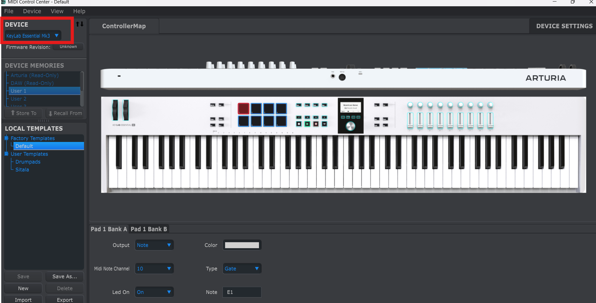
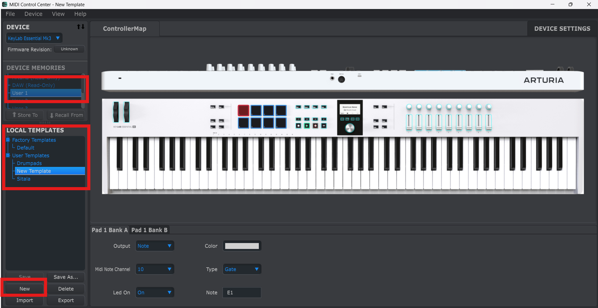
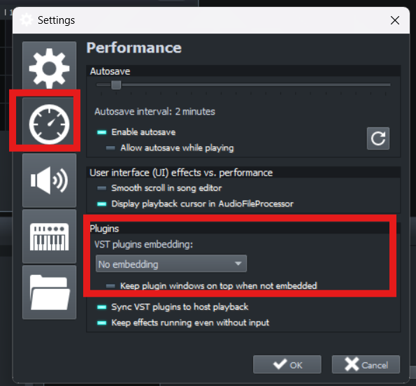
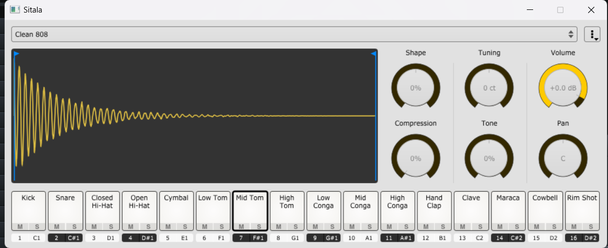

+++
date = '2025-05-03T15:17:43+05:30'
draft = false
title = 'Setting_up_drumpads'
+++

## Pleasantries

> Roses are red  
> Violets are blue  
> I want to play drums using drumpads in LMMS  
> So do you

## What Do I Use?

- I have an [Arturia KeyLab Essential mk3](https://www.arturia.com/products/hybrid-synths/keylab-essential-mk3/overview)
- [DAW](https://en.wikipedia.org/wiki/Digital_audio_workstation): [LMMS](https://lmms.io/)
- OS: Windows 11

## Software Needed

- [Arturia MIDI Control Center](https://www.arturia.com/technology/mcc) – specific to Arturia (other manufacturers may have their own)
- [Sitala](https://plugins4free.com/plugin/2912/) – a free drum sampler that works with LMMS

Install both of the above.

## Make It Work!

### Configuring Arturia MIDI Control Center

- Create a new template using the Arturia MIDI Control Center. You don't need the device plugged in for this step — just select the device under the **Device** dropdown. Once loaded, you'll see the layout on the right.

- Select **User 1** for device memory, then click **New** at the bottom left. Name the template — I’ve called mine **Sitala** (for obvious reasons).

- Click on each drumpad and assign a note from the menu below the keyboard layout. Below is a mapping that works well for Sitala:

| Drumpad Number | Note |
|----------------|------|
| 1              | C1   |
| 2              | C#1  |
| 3              | D1   |
| 4              | D#1  |
| 5              | C#2  |
| 6              | D#2  |
| 7              | F1   |
| 8              | B1   |

### Configuring LMMS for Sitala

- Open LMMS and go to **Edit > Settings**. Set **VST plugin embedding** to **No Embedding**.
- Restart LMMS.
- Load Sitala into **VeSTige** by selecting the Sitala DLL. If you installed Sitala in the default location, you’ll find it at:

> **C:\Program Files (x86)\Steinberg\VstPlugins**

- Sitala should open in a standalone window.
- Connect your MIDI controller to Sitala.
- Load samples into Sitala and start jamming.

## Resources That Helped Me Write This Blog

- [Mapping drumpads in FL Studio](https://www.youtube.com/watch?v=69OZwX9CXO80)
- [Sitala with LMMS](https://www.youtube.com/watch?v=q0cNNL3kgHo&t=430s)
- The LMMS Discord community
